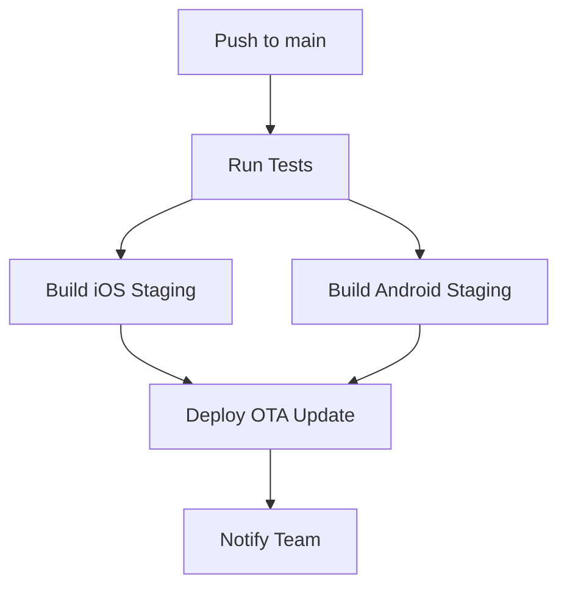
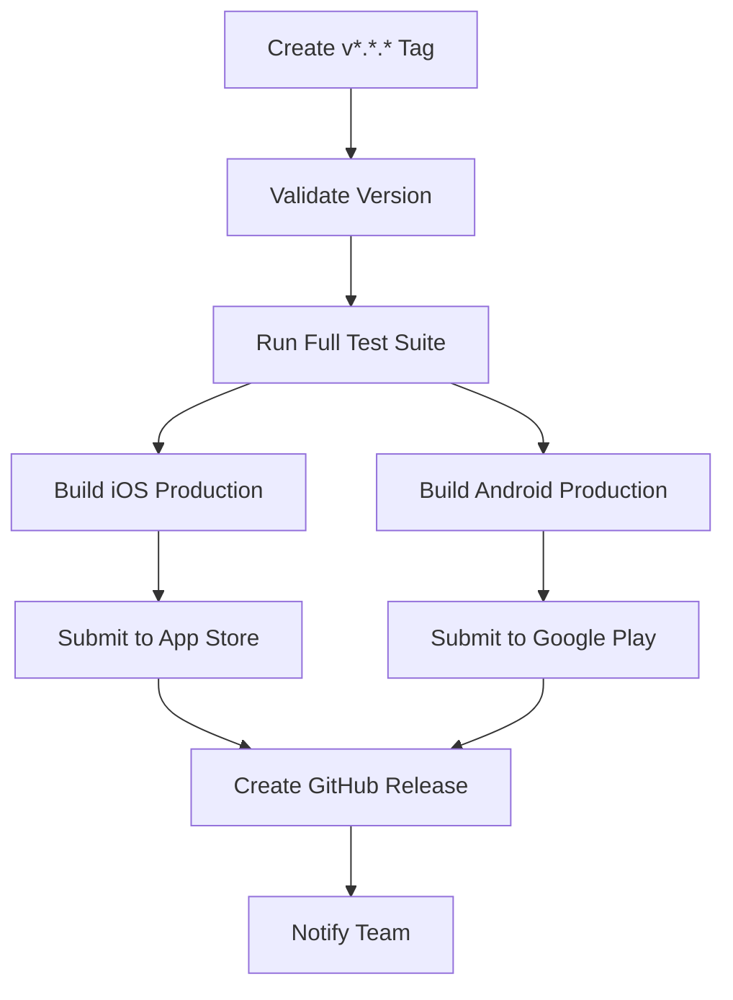

# EAS Build Integration Setup Guide

## Overview

This guide explains how to configure Expo Application Services (EAS) Build integration with GitHub Actions for the Twinship app.

## Prerequisites

1. **Expo Account**: Create an account at [expo.dev](https://expo.dev)
2. **EAS CLI**: Install globally with `npm install -g @expo/eas-cli`
3. **GitHub Repository**: Configured with appropriate secrets

## Required GitHub Secrets

Configure these secrets in your GitHub repository settings (`Settings > Secrets and Variables > Actions`):

### Essential Secrets

```bash
# Expo Authentication
EXPO_TOKEN=your_expo_access_token_here

# Apple App Store (for iOS builds)
APPLE_ID=your_apple_id@example.com
APPLE_TEAM_ID=your_apple_team_id
ASC_APP_ID=your_app_store_connect_app_id

# Google Play Store (for Android builds) 
GOOGLE_SERVICE_ACCOUNT_KEY=base64_encoded_service_account_json

# Optional: Notifications
SLACK_WEBHOOK=your_slack_webhook_url
```

### How to Obtain Secrets

#### 1. EXPO_TOKEN
```bash
# Login to Expo CLI
eas login

# Create access token
eas token:create --read-only=false
```

#### 2. Apple Credentials
- **APPLE_ID**: Your Apple Developer account email
- **APPLE_TEAM_ID**: Found in Apple Developer Account > Membership
- **ASC_APP_ID**: From App Store Connect, select your app and check the URL or General tab

#### 3. Google Service Account
1. Go to Google Cloud Console > APIs & Services > Credentials
2. Create a service account with Google Play Developer API access
3. Download the JSON key file
4. Base64 encode it: `base64 -i service-account-key.json | pbcopy`

## EAS Configuration

The `eas.json` file is already configured with the following profiles:

### Build Profiles

- **development**: Development builds with debug symbols
- **preview**: Internal testing builds  
- **staging**: Pre-production builds
- **production**: Store-ready builds

### Usage Examples

```bash
# Local development build
eas build --profile development --platform ios

# Staging build (triggered by main branch push)
eas build --profile staging --platform all

# Production build (triggered by version tag)
eas build --profile production --platform all
```

## GitHub Actions Workflows

### Staging Deployment (`staging-deploy.yml`)

**Triggered by**: Push to `main` branch

**Actions**:
1. Runs tests and validation
2. Builds iOS and Android staging versions
3. Deploys OTA update to staging channel
4. Sends Slack notifications

### Production Deployment (`production-deploy.yml`)

**Triggered by**: Git tags matching `v*.*.*`

**Actions**:
1. Validates release version
2. Builds production iOS and Android apps
3. Submits to App Store and Google Play
4. Creates GitHub release
5. Sends notifications

## Build Process Flow

### Staging Flow


### Production Flow


## Environment Variables

### Build-time Variables

These are automatically injected during builds:

```json
{
  "env": {
    "NODE_ENV": "production|staging|development",
    "EXPO_PUBLIC_APP_ENV": "$NODE_ENV"
  }
}
```

### Runtime Configuration

Update your app configuration:

```typescript
// src/config/environment.ts
export const ENV = {
  NODE_ENV: process.env.NODE_ENV || 'development',
  APP_ENV: process.env.EXPO_PUBLIC_APP_ENV || 'development',
  // Add other environment-specific config
}
```

## Testing the Integration

### 1. Test Staging Build

Push a commit to the `main` branch:

```bash
git add .
git commit -m "test: trigger staging build"
git push origin main
```

### 2. Test Production Build

Create and push a version tag:

```bash
git tag v1.0.0
git push origin v1.0.0
```

### 3. Monitor Build Progress

- **GitHub Actions**: Check the Actions tab in your repository
- **Expo Dashboard**: Monitor builds at [expo.dev/accounts/[account]/projects/twinship](https://expo.dev)
- **Slack**: Receive notifications (if configured)

## Troubleshooting

### Common Issues

#### Build Fails: "Invalid token"
- Regenerate `EXPO_TOKEN` and update GitHub secret
- Ensure token has write permissions

#### iOS Build Fails: "No signing certificate"
- Run `eas credentials` to configure Apple certificates
- Ensure Apple Developer account is active

#### Android Build Fails: "Google Play API error"
- Verify service account has correct permissions
- Check that the app exists in Google Play Console

#### OTA Update Fails
- Ensure the channel name matches your `eas.json` configuration
- Verify app is published with the correct channel

### Debug Commands

```bash
# Check EAS CLI authentication
eas whoami

# List current builds
eas build:list

# View build details
eas build:view [build-id]

# Check project configuration
eas project:info
```

## App Store Configuration

### iOS App Store Connect Setup

1. Create app in App Store Connect
2. Configure app metadata, screenshots, etc.
3. Set up TestFlight for staging builds
4. Configure App Store distribution group

### Google Play Console Setup  

1. Create app in Google Play Console
2. Set up internal testing track for staging
3. Configure production release track
4. Upload initial APK/AAB manually if required

## Security Best Practices

1. **Rotate Tokens**: Regularly rotate `EXPO_TOKEN` and other credentials
2. **Minimal Permissions**: Use service accounts with minimal required permissions
3. **Environment Separation**: Keep staging and production credentials separate
4. **Secret Management**: Never commit secrets to repository
5. **Build Verification**: Always verify builds before submission

## Next Steps

1. Set up the required GitHub secrets
2. Test staging deployment workflow
3. Configure App Store Connect and Google Play Console
4. Set up monitoring and alerting
5. Plan release schedule and versioning strategy

## Support Resources

- [Expo EAS Build Documentation](https://docs.expo.dev/build/introduction/)
- [GitHub Actions Documentation](https://docs.github.com/en/actions)
- [Apple Developer Documentation](https://developer.apple.com/documentation/)
- [Google Play Console Help](https://support.google.com/googleplay/android-developer/)