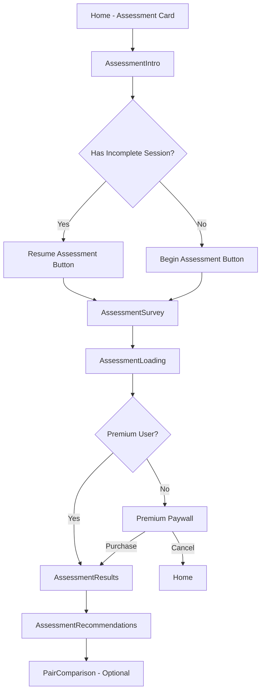

# Twinship Navigation Flow Documentation

## Table of Contents
1. [Navigation Architecture Overview](#navigation-architecture-overview)
2. [User Journey Mapping](#user-journey-mapping)
3. [Screen Relationships](#screen-relationships)
4. [Feature Integration Points](#feature-integration-points)
5. [Navigation State Management](#navigation-state-management)
6. [Mobile UX Patterns](#mobile-ux-patterns)
7. [TypeScript Definitions](#typescript-definitions)
8. [Navigation Best Practices](#navigation-best-practices)

---

## Navigation Architecture Overview

### React Navigation v7 Setup

Twinship uses a **hybrid navigation structure** combining:
- **Bottom Tab Navigator** for primary features (Chat & Home)
- **Stack Navigator** for feature-specific flows and modals
- **Nested Navigators** for complex feature sets (Twintuition)

```typescript
// Core Navigation Structure
NavigationContainer
  └── Stack Navigator (Main Root)
      ├── Onboarding (conditional render)
      └── Main Screens (when onboarded)
          ├── Main (Tab Navigator)
          │   ├── Twinbox (TwinTalkScreen) 
          │   └── Twindex (HomeScreen)
          ├── Feature Stacks (Modal/Push)
          ├── Assessment Flow
          ├── Games Hub
          ├── Premium Flow
          └── Settings/Admin
```

### File Structure
```
src/navigation/
├── AppNavigator.tsx          # Main navigation container
└── TwintuitionNavigator.tsx  # Feature-specific nested navigator

src/screens/
├── [FeatureName]Screen.tsx   # Top-level screens
├── onboarding/               # Onboarding flow screens
├── assessment/               # Assessment flow screens
├── games/                    # Game-specific screens
├── premium/                  # Premium subscription screens
├── chat/                     # Chat-related screens
└── stories/                  # Story creation screens
```

---

## User Journey Mapping

### 1. Onboarding Flow
**Path:** `OnboardingScreen` → Internal Step Navigation → `Main`

```typescript
// Multi-step internal navigation (useState-based)
WelcomeScreen (0)
  ↓ onContinue
PhotoSetupScreen (1)
  ↓ onContinue / ← onBack
PersonalDetailsScreen (2)
  ↓ onContinue / ← onBack
TwinTypeScreen (3)
  ↓ onContinue / ← onBack
ColorSelectionScreen (4)
  ↓ onContinue / ← onBack
ProfileReviewScreen (5)
  ↓ onComplete → sets isOnboarded = true
```

**Key Implementation:**
```typescript
const [currentStep, setCurrentStep] = useState(0);
const screens = [WelcomeScreen, PhotoSetupScreen, ...];
return screens[currentStep];
```

### 2. Assessment Journey
**Path:** `Home` → `AssessmentIntro` → Assessment Flow → Results/Premium



### 3. Games Hub Flow
**Path:** `Home` → `Twingames` → Individual Games → Results

```typescript
// Navigation from Games Hub to specific games
const getGameScreenName = (gameType: PsychicGameType): string => {
  switch (gameType) {
    case 'color_sync': return 'ColorSyncGame';
    case 'number_intuition': return 'NumberIntuitionGame';
    case 'emotion_mirror': return 'EmotionMirrorGame';
    case 'symbol_connection': return 'SymbolConnectionGame';
    case 'time_sync': return 'TimeSyncGame';
  }
};
```

### 4. Premium Conversion Flow
**Multiple Entry Points → Premium Screen → Success/Failure Handling**

```typescript
// Context-aware premium navigation
const handlePurchase = async () => {
  // ... purchase logic
  if (result.success) {
    // Navigate based on entry point
    if (source === 'assessment') {
      navigation.navigate('AssessmentSurvey');
    } else if (source === 'onboarding') {
      navigation.navigate('Main');
    } else {
      navigation.goBack();
    }
  }
};
```

---

## Screen Relationships

### Parent-Child Relationships

```typescript
interface NavigationHierarchy {
  // Root Level
  Main: {
    children: ['Twinbox', 'Twindex'];
    type: 'TabNavigator';
  };
  
  // Feature Flows (Stack-based)
  Assessment: {
    entry: 'AssessmentIntro';
    flow: [
      'AssessmentIntro',
      'AssessmentSurvey', 
      'AssessmentLoading',
      'AssessmentResults',
      'AssessmentRecommendations',
      'PairComparison'
    ];
    premiumGating: ['AssessmentResults', 'AssessmentRecommendations'];
  };
  
  Games: {
    hub: 'Twingames';
    games: [
      'ColorSyncGame',
      'NumberIntuitionGame', 
      'EmotionMirrorGame',
      'SymbolConnectionGame',
      'TimeSyncGame'
    ];
    requiresTwin: true;
  };
  
  Premium: {
    entry: 'Premium';
    contexts: ['assessment', 'settings', 'dashboard', 'onboarding'];
    exit: 'contextual'; // Returns to source
  };
}
```

### Parameter Passing Patterns

```typescript
// Assessment Flow Parameters
type AssessmentParams = {
  AssessmentLoading: { responses: Record<number, number> };
  AssessmentResults: { results: any };
  AssessmentRecommendations: { results: any };
};

// Premium Context Parameters  
type PremiumParams = {
  Premium: { 
    feature?: string; 
    source?: 'assessment' | 'settings' | 'dashboard' | 'onboarding';
  };
};

// Game Session Parameters
type GameParams = {
  [GameScreen]: { sessionId: string };
};
```

### Modal vs Stack Navigation

```typescript
// Modal Presentation (iOS-style)
const modalScreens = [
  'Premium',           // Subscription paywall
  'CreateStory',       // Story creation
  'TwinTalk',         // Chat screen
];

// Stack Push Navigation  
const stackScreens = [
  'AssessmentIntro',   // Assessment flow entry
  'Twingames',        // Games hub
  'Twinsettings',     // Settings screen
];
```

---

## Feature Integration Points

### Home Screen Feature Grid

The `HomeScreen` serves as the primary navigation hub with direct access to all features:

```typescript
// Feature Navigation from Home
const featureNavigation = {
  'Private Chat': () => navigation.navigate('TwinTalk'),
  'Twintuition Alerts': () => navigation.navigate('Twintuition'),
  'Personality Assessment': () => navigation.navigate('AssessmentIntro'),
  'Psychic Games': () => navigation.navigate('Twingames'),
  'Twin Stories': () => navigation.navigate('Stories'),
  'Research Studies': () => navigation.navigate('Twinquiry'),
};
```

### Cross-Feature Navigation Patterns

```typescript
// Assessment → Premium → Assessment (Resume)
AssessmentIntro 
  → Premium (source: 'assessment')
  → [Purchase Success] 
  → AssessmentSurvey

// Games Hub → Twin Connection Required
PsychicGamesHub
  → [No Twin Connected]
  → Display pairing prompt
  → Navigation to pairing flow

// Settings → Premium Features
SettingsScreen
  → Premium (source: 'settings')
  → Feature unlock confirmation
  → Return to Settings
```

### Deep Linking Support

```typescript
// URL Structure Support
const deepLinkRoutes = {
  'twinship://invite/{token}': 'ReceiveInvitation',
  'twinship://assessment/{sessionId}': 'AssessmentResults', 
  'twinship://game/{gameType}': 'GameScreens',
  'twinship://premium': 'Premium',
};
```

---

## Navigation State Management

### BMAD Performance Tracking Integration

The navigation system includes comprehensive performance monitoring:

```typescript
// Navigation Performance Tracking
const bmadTracker = useRef(new BMadNavigationTracker());
const performanceAgent = useRef(new MobilePerformanceAgent());

// Track every navigation event
onStateChange={async () => {
  const currentRouteName = navigationRef.current?.getCurrentRoute()?.name;
  
  // Track screen views
  bmadTracker.current.trackScreenView(currentRouteName, currentRoute?.params);
  
  // Measure navigation timing
  const navStartTime = Date.now();
  requestAnimationFrame(() => {
    const duration = Date.now() - navStartTime;
    bmadTracker.current.trackNavigationTime(
      previousRouteName, 
      currentRouteName, 
      duration
    );
  });
}
```

### Zustand State Integration

Navigation state is synchronized with Zustand stores:

```typescript
// Navigation-State Synchronization
const AppNavigator = () => {
  const isOnboarded = useTwinStore((state) => state.isOnboarded);
  const userProfile = useTwinStore((state) => state.userProfile);
  
  // Conditional navigation based on state
  return (
    <Stack.Navigator>
      {!isOnboarded ? (
        <Stack.Screen name="Onboarding" component={OnboardingScreen} />
      ) : (
        // Main app navigation
      )}
    </Stack.Navigator>
  );
};
```

### Theme Integration with Navigation

Navigation components adapt to user-selected theme colors:

```typescript
// Theme-Aware Tab Bar
const TabNavigator = () => {
  const userProfile = useTwinStore((state) => state.userProfile);
  const themeColor = userProfile?.accentColor || "neon-purple";
  
  const getTabBarColors = () => {
    switch (themeColor) {
      case "neon-pink": return { active: "#ff1493", inactive: "#6b7280" };
      case "neon-blue": return { active: "#00bfff", inactive: "#6b7280" };
      // ... additional theme colors
    }
  };
};
```

---

## Mobile UX Patterns

### Tab Bar Behavior

- **Initial Route:** `Twinbox` (Chat) - Primary feature
- **Tab Icons:** Ionicons with focused/unfocused states
- **Theme Integration:** Dynamic colors based on user accent color selection
- **Backdrop:** Glassmorphism effect with theme-specific backgrounds

```typescript
// Tab Bar Configuration
<Tab.Navigator
  initialRouteName="Twinbox"
  screenOptions={({ route }) => ({
    tabBarIcon: ({ focused, color, size }) => {
      const iconName = focused ? "chatbubbles" : "chatbubbles-outline";
      return <Ionicons name={iconName} size={size} color={color} />;
    },
    tabBarStyle: {
      backgroundColor: colors.background,
      borderTopColor: "rgba(255, 255, 255, 0.1)",
    }
  })}
>
```

### Screen Transitions and Animations

```typescript
// Entrance Animations (Games Hub Example)
const gameScales = allGames.map(() => useSharedValue(0));

React.useEffect(() => {
  // Staggered entrance animations
  gameScales.forEach((scale, index) => {
    scale.value = withDelay(
      400 + (index * 100),
      withSpring(1, { damping: 20, stiffness: 200 })
    );
  });
}, []);
```

### Platform-Specific Considerations

- **iOS:** Modal presentation for premium screens and overlays
- **Android:** Back button handling integrated into navigation flow
- **Gesture Navigation:** Swipe-back enabled for appropriate screens
- **Safe Area:** All screens use `SafeAreaView` from `react-native-safe-area-context`

---

## TypeScript Definitions

### Root Stack Parameter List

```typescript
type RootStackParamList = {
  // Core Navigation
  Onboarding: undefined;
  Main: undefined;
  Twindex: undefined;
  Twinbox: undefined;
  
  // Feature Screens
  TwinTalk: undefined;
  Twintuition: undefined;
  Twingames: undefined;
  Twinquiry: undefined;
  Twinsettings: undefined;
  Twinspirations: undefined;
  
  // Invitation System
  SendInvitation: undefined;
  ReceiveInvitation: { token?: string };
  InvitationAnalytics: undefined;
  
  // Assessment Flow
  AssessmentIntro: undefined;
  AssessmentSurvey: undefined;
  AssessmentLoading: { responses: Record<number, number> };
  AssessmentResults: { results: any };
  AssessmentRecommendations: { results: any };
  PairComparison: undefined;
  
  // Premium Features
  Premium: { 
    feature?: string; 
    source?: 'assessment' | 'settings' | 'dashboard' | 'onboarding' 
  };
  PremiumFeatures: undefined;
  
  // Stories
  Stories: undefined;
  CreateStory: { draftId?: string };
  StoryDetail: { storyId: string };
  EditStory: { storyId: string };
  
  // Utility Routes
  GameStats: undefined;
  Home: undefined;
  Settings: undefined;
  Recommendations: { sessionId: string };
  AssessmentDetails: { sessionId: string };
};
```

### Twintuition Nested Navigator

```typescript
export type TwintuitionStackParamList = {
  TwintuitionHistory: undefined;
  TwintuitionSettings: undefined;
};
```

### Navigation Hook Usage

```typescript
// Screen Component Navigation Pattern
interface ScreenProps {
  navigation: StackNavigationProp<RootStackParamList, 'ScreenName'>;
  route: RouteProp<RootStackParamList, 'ScreenName'>;
}

// Using useNavigation hook
const navigation = useNavigation<StackNavigationProp<RootStackParamList>>();
```

---

## Navigation Best Practices

### 1. Screen Naming Convention
- **Twin-Prefixed Names:** `Twinbox`, `Twindex`, `Twingames`, etc.
- **Clear Purpose:** Screen names indicate functionality
- **Consistency:** Similar features use similar naming patterns

### 2. Parameter Passing
- **Type Safety:** All parameters defined in `RootStackParamList`
- **Optional Parameters:** Use `?` for optional navigation parameters
- **Complex Data:** Pass IDs and fetch data in destination screen

### 3. Navigation Tracking
- **Performance:** Every navigation tracked for performance analysis
- **Analytics:** Screen views logged for user behavior analysis
- **Error Tracking:** Navigation failures captured and reported

### 4. State Management
- **Global State:** Navigation decisions based on Zustand store state
- **Local State:** Component-specific navigation state (onboarding steps)
- **Persistence:** Critical navigation state persisted across app sessions

### 5. Error Handling
```typescript
// Navigation Error Handling Pattern
const navigateWithErrorHandling = (screenName: string, params?: any) => {
  try {
    navigation.navigate(screenName, params);
  } catch (error) {
    console.error('Navigation failed:', error);
    // Fallback navigation or error reporting
  }
};
```

### 6. Premium Feature Gating
```typescript
// Premium Feature Navigation Pattern
const navigateToFeature = (featureName: string) => {
  if (requiresPremium(featureName) && !isPremiumUser) {
    navigation.navigate('Premium', { 
      feature: featureName,
      source: 'feature_access' 
    });
  } else {
    navigation.navigate(featureName);
  }
};
```

---

## Conclusion

The Twinship navigation architecture balances simplicity with feature richness, using React Navigation v7's capabilities to create smooth user experiences across complex feature sets. The hybrid tab/stack structure, combined with comprehensive state management and performance tracking, provides a solid foundation for the twin-focused mobile application.

Key architectural decisions:
- **Performance-First:** BMAD integration for comprehensive monitoring
- **Type-Safe:** Full TypeScript coverage of navigation parameters
- **Theme-Aware:** Dynamic styling based on user preferences
- **Context-Aware:** Premium and pairing state influence navigation flows
- **Mobile-Optimized:** Platform-specific patterns and gestures supported

This documentation serves as both a technical reference and implementation guide for developers working on the Twinship navigation system.